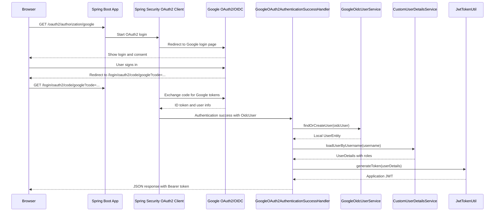

# spring-security

Spring Boot 2.5 sample project for username/password login, JWT-protected APIs,
role-based authorization, and Google OAuth2/OIDC login.

## Stack

- Java 11+
- Spring Boot 2.5.0
- Spring Security
- Spring Data JPA
- PostgreSQL
- JWT (`io.jsonwebtoken:jjwt:0.9.1`)
- BCrypt password hashing
- Google OAuth2 Client

## Features

- Register local users.
- Authenticate with username and password.
- Return application JWTs for API calls.
- Authorize endpoints by role.
- Login with Google and issue the same application JWT.
- Refresh JWTs through the project-specific expired-token flow.

## Requirements

- JDK 11 or newer
- Maven wrapper included in this repository
- PostgreSQL running locally

Default database settings are in `src/main/resources/application.yml`:

```yaml
spring:
  datasource:
    url: jdbc:postgresql://localhost:5432/SpringSecurity
    username: postgres
    password: postgres
  jpa:
    properties:
      hibernate:
        default_schema: role_base_auth
```

## Google Login Configuration

Copy the example file and add real Google OAuth client credentials:

```bash
cp config.example.json config.json
```

Example:

```json
{
  "google": {
    "client-id": "your-google-client-id",
    "client-secret": "your-google-client-secret"
  }
}
```

Use this Google redirect URI for local development:

```text
http://localhost:8080/login/oauth2/code/google
```

## Run

```bash
./mvnw spring-boot:run
```

On Windows:

```powershell
.\mvnw.cmd spring-boot:run
```

## Test

```bash
./mvnw test
```

On Windows:

```powershell
.\mvnw.cmd test
```

## API Endpoints

| Method | Endpoint | Access |
| --- | --- | --- |
| `POST` | `/register` | Public |
| `POST` | `/authenticate` | Public |
| `GET` | `/api/secure/info` | Authenticated |
| `GET` | `/admin-user` | `ROLE_ADMIN` |
| `GET` | `/normal-user` | `ROLE_ADMIN` or `ROLE_USER` |
| `GET` | `/refreshtoken` | Expired-token refresh flow |
| `GET` | `/oauth2/authorization/google` | Public Google login start |

## Sample Requests

Register:

```http
POST /register
Content-Type: application/json

{
  "username": "admin",
  "password": "password",
  "roleList": [
    {
      "roleName": "ROLE_ADMIN"
    }
  ]
}
```

Login:

```http
POST /authenticate
Content-Type: application/json

{
  "username": "admin",
  "password": "password"
}
```

Response:

```json
{
  "token": "eyJhbGciOiJIUzUxMiJ9..."
}
```

Call a protected endpoint:

```http
GET /api/secure/info
Authorization: Bearer <jwt-token>
```

Refresh an expired token:

```http
GET /refreshtoken
Authorization: Bearer <expired-jwt-token>
isRefreshToken: true
```

## Google Login Flow

Open this URL in a browser:

```text
http://localhost:8080/oauth2/authorization/google
```

After successful Google login, the app returns a JSON response containing:

- `tokenType`
- `token`
- `username`
- Google profile details

Use the returned `token` as a Bearer token for protected API calls.

## Google Token Workflow

When the browser calls:

```http
GET /oauth2/authorization/google
```

Spring Security starts the Google OAuth2/OIDC login flow. After Google verifies
the user, this project creates its own application JWT and returns it from
`GoogleOAuth2AuthenticationSuccessHandler`.



Plain flow:

```text
/oauth2/authorization/google
        |
        v
Redirect to Google login
        |
        v
Google redirects back to /login/oauth2/code/google
        |
        v
Spring Security validates Google identity
        |
        v
Find or create local user
        |
        v
Load local user roles
        |
        v
Generate application JWT
        |
        v
Return JSON token response
```

The returned token is this application's JWT, not Google's access token.

## Postman Collections

The repository includes:

- `Spring-Security.postman_collection.json`
- `Spring-Security-Google-OIDC.postman_collection.json`

## Important Classes

- `SecurityConfiguration` - Spring Security rules and filter chain.
- `CustomJwtAuthenticationFilter` - reads and validates Bearer tokens.
- `JwtTokenUtil` - creates, parses, validates, and refreshes JWTs.
- `CustomUserDetailsService` - loads users and authorities.
- `AuthenticationController` - local login and token refresh endpoints.
- `GoogleOAuth2AuthenticationSuccessHandler` - creates an application JWT after Google login.
- `GoogleOidcUserService` - maps Google users into local users.

## Notes

- The app uses JWTs for API authentication.
- Google login is only an identity provider; this app still issues its own JWT.
- Spring Boot 2.5 uses `antMatchers(...)` in the security configuration.
- `config.json` should stay local and should not be committed.
